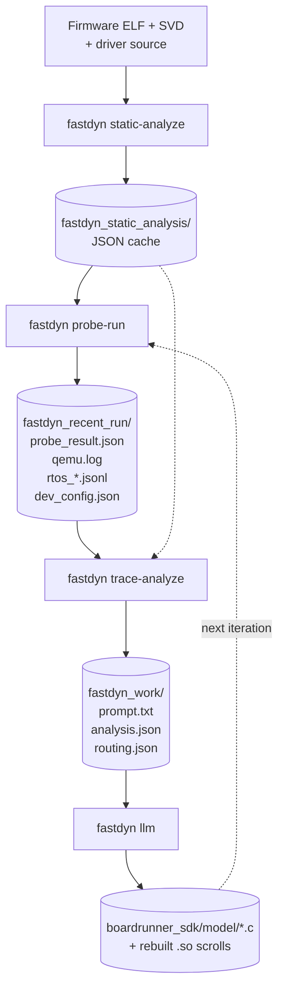

# FastDyn CLI and Automatic Rehosting Integration Guide

*FIRE FastDyn | STR Integration Documentation | Main branch (As-of-date 30 Aug 2026)*

**Purpose.** This guide documents the current command-line integration path for FastDyn, with emphasis on the information STR requires for tool integration: the CLI entry points and parameters, the multi-stage automatic rehosting pipeline (currently: static analysis → probe run → trace analysis → LLM), the on-disk artifacts produced at each stage, the container build/run procedure, and FastDyn's role in the FIRE multi-fidelity workflow. The scope covered here is **LLM-driven, driver-source-only rehosting without any hardware trace**: given a firmware ELF, the firmware's driver source tree, and a machine description (SVD + TOML), FastDyn iteratively discovers and generates peripheral device models until the firmware achieves the required functionality and is fully rehosted.

| STR requested information | Covered in |
|---|---|
| CLI parameters and usage | Section 1: `fastdyn` entry point, subcommand reference, invocation examples. |
| How the tool consumes models and firmware inputs | Section 2: static-analysis cache, `boardrunner_sdk` model layout, TOML `[Device.*]` conventions. |
| Workflow / integration example | Section 3: four-stage loop with concrete artifact hand-offs; Section 5 walk-through. |
| FIRE toolchain relationship | Section 4: FastDyn as the firmware-hosted Hi-Fi confirmation layer downstream of Rumoca / CP-Reach / CP-Glimpse. |
| Docker build and smoke test | Section 5: container build, verification steps, expected artifacts, integration checklist. |
| IP-sensitivity of LLM prompts | Section 6: transparent account of what firmware content is sent to the LLM. |

> **Architecture status note.** FastDyn's LLM-driven rehost stage is under active development. The user-facing contract this document intends to keep stable is the **CLI-driven pipeline shape** (a small set of subcommands invoked from a container, driven by a single TOML per firmware, producing artifacts under a work directory) rather than the exact command names or stage boundaries. The **TOML configuration schema**, the **Docker build recipe**, the **static-analysis cache format**, and the **artifact categories listed in §5.4** are intended to remain consistent. The current pipeline exposes four subcommands (`static-analyze`, `probe-run`, `trace-analyze`, `llm`); future revisions may consolidate or rename stages — in particular, `trace-analyze` and `llm` may merge into a single execution step. Integration automation should pin a tested FastDyn revision and expect that command names, `llm`-side flags, and internal artifact files may change between revisions.

## Integration workflow at a glance



Each iteration of this loop either advances the firmware past a previously unhandled MMIO access, refines a peripheral model that returned wrong values, or emits a routing decision when the LLM determines that a different peripheral is at fault. The loop terminates when the firmware reaches a user-specified milestone (control loop, arming, first sensor read, etc.) without further MMIO faults.

> **Scope note.** This document intentionally omits the hardware-trace (`twintrace`) record/replay flow and the `LIBHW=true` physical-hardware backend. Both are supported by the same CLI but are out of scope for automatic LLM-driven rehosting. The subcommand reference below flags the options that belong to those flows as *(hardware-mode; not used here)*.

## 1. CLI Interface

**Entry point.** The installed command is `fastdyn` (also registered as `boardrunner`), declared in `setup.py` under `console_scripts` as `fastdyn = fastdyn.main:cli`. The implementation is in `src/fastdyn/main.py`.

```bash
# Verify the installed interface
fastdyn --help

# Discover subcommands
fastdyn static-analyze --help
fastdyn probe-run     --help
fastdyn trace-analyze --help
fastdyn llm           --help
```

FastDyn is driven by a single TOML per firmware/board pair (typically under `configs/`). The TOML defines the QEMU machine, memory backing, ELF path, plugin options, and the peripheral model routing table. Command-line flags are intentionally minimal; most behavior comes from the TOML so that the same configuration can be reused across `probe-run`, `trace-analyze`, and rerun automation.

### 1.1 Automatic-rehosting subcommands

The pipeline subcommands share the `-c/--config` flag and read from the same TOML. Output directories default to sensible sibling paths and can be overridden via `-o/--work-dir`. The flag tables below list the primary, stable options for each subcommand; additional tuning flags are exposed by each subcommand's `--help` and are part of the current execution model that may evolve.

#### 1.1.1 `fastdyn static-analyze`

Builds the offline analysis cache from the ELF and SVD. Runs once per firmware; subsequent stages reuse the cache.

| Flag | Type / Default | Purpose |
|---|---|---|
| `-c, --config` | path (required) | TOML configuration for the target board. |
| `--binary` | path (override) | Overrides `[CPU.cpu0].binary`. Useful when swapping firmware variants against the same board TOML. |
| `-s, --svd` | path (default: `third_party/common/cmsis-svd-data`) | SVD file or directory of SVDs. FastDyn selects by `[Machine].platform`. |
| `--force` | flag | Recompute even if the cache directory is populated. |
| `--format` | choice: `json` | Output format (only `json` currently). |

Reads `[Rehosting.directories]` for `static_analysis_cache_dir` and `firmware_source_roots`, and reads `[Rehosting.static_analysis.macros]` for macro-extraction settings.

#### 1.1.2 `fastdyn probe-run`

Executes the firmware under QEMU with the FastDyn plugin loaded. On an unhandled MMIO access, the plugin captures the fault (address, PC, program state) and either records it into `probe_faults.json` (for later routing) or attempts an auto-generated stub model on-the-fly.

| Flag | Type / Default | Purpose |
|---|---|---|
| `-c, --config` | path (required) | TOML configuration. |
| `-o, --work-dir` | path (default: `./fastdyn_work`) | Output directory. Cleaned on each run unless `--persist-work-dir`. |
| `-s, --svd` | path (override) | SVD override for this run. |
| `-p, --persist-work-dir` | flag | Preserve outputs across successive runs. |
| `--run-gdb / --no-run-gdb` | flag (override) | Force `[Machine].enable_gdb` on or off from the CLI. When on, QEMU pauses at reset and exposes gdbstub on `localhost:1234`. |
| `--rtos-introspect / --no-rtos-introspect` | flag | Enable RTOS thread introspection using the RTOS schema produced by `static-analyze`. |
| `--rtos-introspect-mode` | choice: `summary\|events\|debug` (default: `summary`) | Verbosity of the RTOS trace. |
| `--rtos-introspection-max-events` | int (default: 4096) | Cap on stored context-switch events. |

Preconditions: a valid static-analysis cache. If the cache is missing or stale, run `static-analyze --force` first.

#### 1.1.3 `fastdyn trace-analyze`

Consumes the probe-run artifacts plus the static-analysis cache, correlates them, and produces a structured LLM prompt plus a routing decision file. Deterministic — does not call the LLM.

| Flag | Type / Default | Purpose |
|---|---|---|
| `-c, --config` | path (required) | TOML configuration. |
| `-o, --work-dir` | path (default: `./fastdyn_work`) | Directory where the LLM prompt, analysis metadata, and per-analysis snapshot subdirectory are written. |
| `--latest-run-dir` | path (default: auto-discover) | Path to the probe-run output directory (`fastdyn_recent_run/`). |
| `-s, --svd` | path (override) | SVD override. |
| `--force` | flag | Recompute even if analysis output already exists. |

Additional flags controlling routing hand-offs between iterations and per-analysis prompt naming are documented in `fastdyn trace-analyze --help`; those are part of the current stage-based execution model and may evolve.

Preconditions: `probe_result.json` from a completed probe-run and a valid static-analysis cache.

#### 1.1.4 `fastdyn llm`

Sends the prompt to the configured LLM provider (OpenAI or Ollama), parses the response, patches model files, and optionally recompiles.

| Flag | Type / Default | Purpose |
|---|---|---|
| `-d, --work-dir` | path (required) | Directory containing the LLM prompt and optional analysis metadata. |
| `-o, --output` | path (repeatable, optional) | Target model `.c` file(s) to patch. Auto-detected from analysis metadata when omitted. |
| `--model` | str | Model name (e.g., `gpt-4o`, or an Ollama-hosted model tag). |
| `--model-provider` | choice: `openai\|ollama` | Backend selection. |
| `--env-file` | path (default: `~/.fastdyn.env`) | Loads `OPENAI_API_KEY` from this file. |
| `--compile / --no-compile` | flag | Rebuild the affected model `.so` after applying the patch. |
| `--sdk-dir` | path (default: `boardrunner/boardrunner_sdk`) | SDK root for compilation. |
| `--evaluate / --no-evaluate` | flag | Append per-call metrics to the LLM history directory. |
| `--ollama-url` | url | Ollama server endpoint. |

Additional flags controlling sampling temperature, reasoning-effort, retry behavior, conversation state, and Ollama tuning parameters are documented in `fastdyn llm --help`; the set may evolve as the LLM stage's execution model matures.

The `llm` subcommand accepts prompts produced by `trace-analyze` and writes patches, new files, or routing decisions back into the work directory. The set of response types and the iteration control mechanism are implementation details of the current execution model and may change in future revisions; the CLI shape and I/O contract remain stable.

### 1.2 Docker execution

The repository includes a `Dockerfile` at the project root that produces a complete FastDyn environment (Ubuntu 24.04 base, patched QEMU, Ghidra 12.0.4, Gazebo Harmonic, Python venv, and the FastDyn plugin `libfastdyn.so`).

```bash
# From the workspace directory that contains FastDyn/, qemu/, libhw/
docker build -f FastDyn/Dockerfile -t fastdyn-env .

# Interactive container with the CLI on PATH
docker run --rm -it fastdyn-env

# Non-interactive one-shot invocation
docker run --rm -v "$PWD/configs:/mnt/configs" fastdyn-env \
  fastdyn static-analyze -c /mnt/configs/rover462.toml \
  -s third_party/common/cmsis-svd-data --force
```

The image entrypoint drops into `/workspace/FastDyn` with the Python venv activated. `fastdyn` and `boardrunner` are both on `PATH`. `LD_LIBRARY_PATH` includes the libhw output directory; `GHIDRA_INSTALL_DIR` is set for the static-analysis frontend.

### 1.3 Secondary subcommands (reference only)

The following subcommands exist on the CLI and are documented here for completeness; they are not used by the automatic rehosting flow described in this guide:

- `fastdyn run` — one-shot QEMU launch (no probe loop) once the firmware is fully rehosted.
- `fastdyn loop` — wrapper around `run` with auto-restart on clean exit.
- `fastdyn swarm` — parallel workers with per-worker port ranges.
- `fastdyn verifier` — cross-check emulated behavior against a reference hardware log *(hardware-mode; not used here)*.
- `fastdyn fuzz` — hardware-trace-driven data-register discovery *(hardware-mode; not used here)*.
- `fastdyn generate` — legacy prompt generation from a hardware trace *(hardware-mode; not used here)*.
- `fastdyn timing-summary`, `fastdyn harness` — instrumentation utilities.

## 2. How FastDyn Consumes Models and Firmware Inputs

### 2.1 Primary inputs

| Input | Provided as | Purpose |
|---|---|---|
| Firmware ELF | `[CPU.cpu0].binary` in TOML | The image QEMU executes and the static analyzer reads. |
| Machine description | `[Machine]`, `[Memory]`, `[CPU]` in TOML | QEMU target selection, memory backing, timer / semihosting / GDB options. |
| Peripheral routing table | `[Device.*]` in TOML | Which peripheral models handle which MMIO ranges, and which slave devices are attached to shared buses. |
| MCU / SVD description | `-s/--svd` or default `third_party/common/cmsis-svd-data` | Maps MMIO addresses to peripheral and register names. |
| Firmware driver source roots | `[Rehosting.directories].firmware_source_roots` | Provides ArduPilot-style HAL drivers for macro extraction and source context in prompts. |
| Firmware build roots | `[Rehosting.directories].firmware_build_roots` | Provides compile-unit metadata (DWARF, preprocessed macros) when the source tree alone is insufficient. |
| Modeling directory | `[Rehosting.directories].modeling_dir` | Where LLM-generated / hand-edited peripheral models live (`boardrunner/boardrunner_sdk/model/*.c`). |

### 2.2 Static analysis cache layout

After `fastdyn static-analyze`, the cache directory contains a stable set of JSON artifacts used by all downstream stages. Names in the current implementation include:

| Artifact | Contents |
|---|---|
| `binary.json`, `sections.json`, `segments.json` | ELF metadata, load segments. |
| `symbols.json`, `functions.json` | Symbol table with demangled names and function bounds. |
| `compile_units.json`, `source_map.json` | DWARF compile-unit → source-file mapping. |
| `vector_table.json`, `irq_handlers.json` | Cortex-M vector table and IRQ handler symbols. |
| `svd_map.json`, `svd_summary.json` | SVD peripheral / register maps aligned to the machine platform. |
| `callgraph.json` | Static call graph derived from the disassembly. |
| `probe_faults.json` | Predicted MMIO fault sites used to warm up the probe loop. |
| `rtos_identity.json`, `rtos_symbols.json`, `rtos_schema.json`, `rtos_schema.txt` | RTOS type detection and introspection schema. |
| `macro_context.json`, `macros/index.json`, `macros/*.json` | Extracted preprocessor macros. |
| `constants.json`, `literal_pools.json`, `mmio_constants.json` | Constant pools referenced from code. |

### 2.3 Peripheral models — `boardrunner_sdk` layout

Generated peripheral models live under `boardrunner/boardrunner_sdk/`. Model authors generate one C file per peripheral in `model/*.c`; each file compiles to a same-named `.so` scroll in `boardrunner/boardrunner_sdk/build/`. The scrolls are loaded by the FastDyn plugin based on the TOML routing table.

```
boardrunner/boardrunner_sdk/
├── boardrunner_vio/          shared VIO / API library (SPI, I2C, DMA, PTY, FIFO, signals)
│   └── src/
├── include/boardrunner/      public headers exposed to model writers
│   ├── vio.h                 umbrella header
│   ├── spi.h, i2c.h, dma.h, signals.h, pty.h, net.h, fifo.h, fileio.h
│   └── imu_sample.h          canonical sample types for sensor VIO
├── model/                    one .c file per peripheral or slave
│   ├── rcc.c, pwr.c, systick.c, dwt.c, flash.c
│   ├── gpioa.c … gpioi.c
│   ├── spi1.c, spi2.c, spi4.c, i2c1.c, i2c2.c
│   ├── usart2.c, usart3.c, uart4.c, uart7.c, uart8.c, usart6.c
│   ├── icm20602_spi.c, icm20948_spi.c, mpu9250_spi.c   (SPI slaves)
│   ├── ms5611_spi1.c, ms5611_spi4.c, ramtron_fram_spi.c
│   └── ap_iomcu_uart_endpoint.py                         (host-side endpoint helper)
└── build/                    per-model .so artifacts (generated)
```

Each `[Device.<name>]` block in the TOML declares an MMIO range and points at one `.so` handler; optional `[[Device.<name>.connections]]` sub-blocks declare either **slaves** (real devices attached to the bus — routed to QEMU via the plugin) or **endpoints** (host-side backends only — informational, not forwarded). This lets a single `spi4.c` bus controller multiplex several slave device models (ICM20602, ICM20948, MS5611) on different chip-select lines.

### 2.4 Iterative discovery loop

`probe-run` does not require the modeling directory to be complete before it starts. When the firmware performs an MMIO access to a range that is either not covered by any `[Device.*]` block or handled by a stub, the FastDyn plugin captures the fault. The next stages (`trace-analyze` → `llm`) either fill in a new model file, update an existing one, or emit a routing decision that renames / relocates the responsibility. Progress across iterations is tracked by counting basic-block coverage of the firmware image and by the milestone symbol list in `[Machine].milestones`.

## 3. Combining Stages: End-to-End Rehosting Workflow

The four subcommands compose into a single deterministic pipeline. The following is the intended per-iteration sequence, plus how a caller reruns individual stages when they need to.

### 3.1 First-iteration flow

```
1. fastdyn static-analyze -c configs/<board>.toml \
     -s third_party/common/cmsis-svd-data --force
   → fills fastdyn_static_analysis/

2. fastdyn probe-run -c configs/<board>.toml -o fastdyn_recent_run
   → runs QEMU until it either hits a milestone, faults on an
     unhandled MMIO range, or the caller stops the run
   → fills fastdyn_recent_run/probe_result.json, qemu.log,
     rtos_summary.json, rtos_recent_switches.jsonl, dev_config.json

3. fastdyn trace-analyze -c configs/<board>.toml \
     -o fastdyn_work --latest-run-dir fastdyn_recent_run
   → fills fastdyn_work/prompt.txt, fastdyn_work/analysis.json
   → fills fastdyn_work/trace_analysis/<analysis_id>/{prompt.txt,
     selected_source.c, selected_macros.json, io_context.json,
     exec_trace.json, analysis.json}

4. fastdyn llm -d fastdyn_work --compile --model gpt-4o \
     --reasoning-effort medium --evaluate
   → sends fastdyn_work/prompt.txt to the LLM
   → applies SEARCH/REPLACE or writes a new model .c file
   → invokes cmake to rebuild the affected .so
   → appends fastdyn_llm_history/NNN_prompt.txt,
     NNN_response_*.txt, and metrics.jsonl
```

Then loop back to step 2. Each pass usually advances the firmware further into initialization. Coverage growth and milestone hits are the intended per-iteration success signal.

### 3.2 Rerunning individual stages

Under the current execution model, callers rerun stages manually as described below. Future revisions may consolidate this into a more autonomous loop; the CLI invocations documented here will continue to work either way.

Each stage is idempotent when re-invoked with `--force`:

- Re-run `static-analyze --force` when the firmware ELF changes.
- Re-run `probe-run` after any change to a model `.so`; the cache is unaffected.
- Re-run `trace-analyze` when the LLM has produced a `routing.json` that needs to become the next prompt, or when the last probe-run produced different exit reasons.
- Re-run `llm` when adjusting model, reasoning-effort, temperature, or provider parameters against the same prompt.

## 4. FIRE Project Integration Vision
TODO

## 5. Recommended STR Run Procedure and Smoke Test

### 5.1 Container build

From the workspace directory that contains FastDyn/, qemu/, libhw/:

```bash
docker build -f FastDyn/Dockerfile -t fastdyn-env .
```

The build runs `setup.sh --build-qemu --build-gazebo --skip-optifuzz` and then `make PROBE=true DEV=true LIBHW=true LIBGZ=true FLIGHT_CONTROLLERS=true DEBUG_PRINT=true LIBFUZZ=true`. The resulting image is self-contained: no host QEMU or Ghidra install is required.

### 5.2 Verify the CLI is installed and visible

```bash
docker run --rm fastdyn-env fastdyn --help
# Expected: click-based help listing static-analyze, probe-run, trace-analyze,
# llm, run, loop, swarm, verifier, fuzz, timing-summary, harness, generate.
```

### 5.3 Run the rehost pipeline against the reference board

The delivered reference board is ArduRover 4.6.2 on CubeBlack (`configs/rover462.toml`). The firmware image is included at `virtuals/physics/flight_controllers/courbet/bin/ardurover_v462`.

```bash
# Step 1 — offline analysis
fastdyn static-analyze \
  -c configs/rover462.toml \
  -s third_party/common/cmsis-svd-data \
  --force

# Step 2 — probe run (produces artifacts under fastdyn_recent_run/)
fastdyn probe-run \
  -c configs/rover462.toml \
  -o fastdyn_recent_run \
  --rtos-introspect

# Step 3 — trace analysis (produces prompt.txt under fastdyn_work/)
fastdyn trace-analyze \
  -c configs/rover462.toml \
  -o fastdyn_work \
  --latest-run-dir fastdyn_recent_run

# Step 4 — LLM stage (patches models and rebuilds .so scrolls)
fastdyn llm \
  -d fastdyn_work \
  --compile \
  --model gpt-4o \
  --evaluate
```

Additional tuning flags for each step (RTOS-trace verbosity and buffer limits, sampling temperature, reasoning-effort, retries) are available via each subcommand's `--help`; the values shown above are the minimum set needed to complete a smoke run.

### 5.4 Expected artifacts

| Artifact | Purpose / expected content |
|---|---|
| `fastdyn_static_analysis/` | JSON cache of ELF metadata, DWARF, SVD map, RTOS schema, macro extraction, and probe-fault predictions. Reused by every subsequent stage. |
| `fastdyn_recent_run/probe_result.json` | Exit reason, final PC, unique / total basic-block counts, retained BBL trace, RTOS summary, and (if applicable) the address of the unhandled MMIO fault. |
| `fastdyn_recent_run/qemu.log` | Full QEMU emulation log with the plugin's memory / DMA trace lines interleaved. |
| `fastdyn_recent_run/rtos_summary.json` | Thread table with priorities, states, and scheduled counts. |
| `fastdyn_recent_run/rtos_recent_switches.jsonl` | Recent context switches in event mode. |
| `fastdyn_recent_run/dev_config.json` | Fully materialized device / handler / slave table derived from the TOML. |
| `fastdyn_work/prompt.txt` | The LLM prompt for this iteration. Contains loaded-peripheral summary, RTOS context, DMA / memory trace excerpts, execution-trace summary, source context, macros, and diagnostic instructions. |
| `fastdyn_work/analysis.json` | Metadata for the prompt: analysis_id, run_id, prompt_kind, target_peripheral, exit_reason, config path, modeling dir. |
| `fastdyn_work/routing.json` | (Iteration-produced) LLM routing decision when the pipeline cannot identify the fault peripheral. Consumed on the next `trace-analyze --apply-routing`. |
| `fastdyn_work/trace_analysis/<analysis_id>/` | Per-analysis snapshot: `prompt.txt`, `selected_source.c`, `selected_macros.json`, `io_context.json`, `exec_trace.json`, `analysis.json`. |
| `fastdyn_llm_history/` | Persistent history: `NNN_prompt.txt`, `NNN_response_*.txt` per iteration, plus `metrics.jsonl` when `--evaluate` is used. |
| `boardrunner/boardrunner_sdk/model/*.c`, `.../build/*.so` | Patched / newly created peripheral models and their compiled scrolls. |

### 5.5 STR integration checklist

- Verify that the FastDyn image builds successfully from the provided `Dockerfile` and that `fastdyn --help` runs inside the container.
- Verify that a valid `.env` file (or environment variables) is available with `OPENAI_API_KEY` before invoking `fastdyn llm --model-provider openai`, or that a running Ollama endpoint is reachable at `--ollama-url` when using `--model-provider ollama`.
- Run `static-analyze` against the reference `configs/rover462.toml` and confirm that `fastdyn_static_analysis/` contains the artifacts enumerated in § 2.2.
- Run one `probe-run` iteration and confirm that `probe_result.json` and `qemu.log` are produced, and that `rtos_summary.json` shows a non-zero thread count when RTOS introspection is enabled.
- Run `trace-analyze` and confirm that `prompt.txt` and `analysis.json` are produced under both `fastdyn_work/` and `fastdyn_work/trace_analysis/<analysis_id>/`.
- Run `fastdyn llm --evaluate` and confirm that a new `NNN_prompt.txt` / `NNN_response_1.txt` pair appears under `fastdyn_llm_history/` and that `metrics.jsonl` gets a new record.
- Verify that any generated / edited `boardrunner_sdk/model/*.c` compiles cleanly against `libboardrunner_vio.so` and that the resulting `.so` loads on the next `probe-run` without warnings.
- Verify that repeated iterations of the four-stage loop monotonically increase unique-basic-block coverage or advance the last-hit milestone recorded in `analysis.json`.

## 6. Firmware-Content Transparency for LLM Prompts

This section is an honest account of what firmware-derived content ends up in the prompt sent to the LLM, so that integrators whose firmware is IP-sensitive can make an informed decision.

**Always included** (when the corresponding data is available in the static-analysis cache):

- Source snippets from the driver source tree for functions touched by the execution trace, up to a bounded window per function (currently around 260 lines).
- Function symbols in both mangled and demangled form, restricted to functions observed in the trace or explicitly requested by reference.
- Preprocessor macro definitions transitively referenced by the selected source snippets (not the full build's macro closure).
- MMIO register access log: addresses, register names resolved via SVD, values, PCs.
- Compressed execution-trace summary (callgraph-collapsed, not raw PC sequence) plus CPU register snapshot at the point of interest.
- The `[Device.<target>]` TOML section for the peripheral currently under analysis, so the LLM knows the MMIO range and connected slaves.
- Board hardware summary table (loaded peripherals, ranges, descriptions, connection topology).

**Conditionally included:**

- RTOS context (thread names, priorities, states, recent context switches) only when RTOS introspection is enabled and the schema is present in the cache.
- The current device-model source (the `.c` file being patched) only in `implementation` and `routed` prompts, not in diagnostic prompts.
- The full text of a prior LLM `routing.json`, only when `--apply-routing` is used and only in the specific analysis directory for that iteration.

**Never included:**

- Absolute host filesystem paths. All source paths are normalized to `source_root_relative` (e.g., `libraries/AP_HAL_ChibiOS/UARTDriver.cpp` rather than the full host path).
- Git remote URL, branch, or commit hash of the firmware source.
- TOML sections other than the target peripheral's own block.
- Memory / register values from outside the observed trace window.
- Environment variables, credentials, or `~/.fastdyn.env` contents.

**No built-in redaction beyond the above.** There is currently no CLI flag to force a symbol-only prompt that omits source snippets, nor a heuristic to redact specific identifier names inside a selected snippet. Integrators whose firmware source cannot be disclosed to a third-party LLM should either run against a local Ollama endpoint (via `--model-provider ollama --ollama-url ...`), or gate FastDyn behind their own review of the material in `fastdyn_work/trace_analysis/<analysis_id>/prompt.txt` and `selected_source.c` before invoking `fastdyn llm`. Every prompt is persisted to `fastdyn_llm_history/NNN_prompt.txt` before the LLM call, so an out-of-band review or filter can be inserted at that point.

## 7. Reference Configuration

The delivered reference board configuration is `configs/rover462.toml`, an ArduRover 4.6.2 on CubeBlack (STM32F427):

```toml
[Rehosting.directories]
static_analysis_cache_dir = "./fastdyn_static_analysis"
firmware_source_roots     = ["/path/to/ardupilot"]
firmware_build_roots      = ["/path/to/ardupilot_build"]
modeling_dir              = "boardrunner/boardrunner_sdk/model"

[Machine]
platform    = "STM32F427"
qemu_path   = "../qemu/build/qemu-system-arm"
icount      = { shift = 5, sleep = false, align = false }
enable_gdb  = false
log_file    = "qemu.log"

[CPU]
[[CPU.cpu0]]
arch            = "arm"
machine         = "cortexm"
cpu             = "cortex-m4"
plugin_library  = "build/libfastdyn.so"
binary          = "virtuals/physics/flight_controllers/courbet/bin/ardurover_v462"
init_nsvtor     = "0x08004000"

[Device.rcc]
ranges = [["0x40023800", "0x40023c00"]]
[[Device.rcc.handlers]]
model   = "elder"
enabled = true
scroll  = "boardrunner/boardrunner_sdk/build/rcc.so"

[Device.spi4]
ranges = [["0x40013400", "0x40013800"]]
[[Device.spi4.handlers]]
model   = "elder"
enabled = true
scroll  = "boardrunner/boardrunner_sdk/build/spi4.so"

[[Device.spi4.connections]]
type          = "slave"
name          = "icm20602_spi.c"
cs_id         = 4
bus           = "spi"
device_scroll = "boardrunner/boardrunner_sdk/build/icm20602_spi.so"
```

Additional peripheral blocks (GPIO A–I, PWR, SPI1 / SPI2, I2C1 / I2C2, USART2 / 3 / 6, UART4 / 7 / 8, DMA1 / DMA2, SysTick, DWT, Flash, SDIO, TIM1 / 2 / 4 / 5, RTC, IWDG, SCB, OTG_FS) follow the same pattern.

---

**Reference repository.** FastDyn — internal to the FIRE program. The reference firmware / physics assets for the ArduPilot family live under `virtuals/physics/flight_controllers/courbet/`. A companion vehicle-authoring workflow via Rumoca is available under `[FMU]` blocks in the copter / plane variants (`configs/copter462.toml`, `configs/plane462.toml`).
