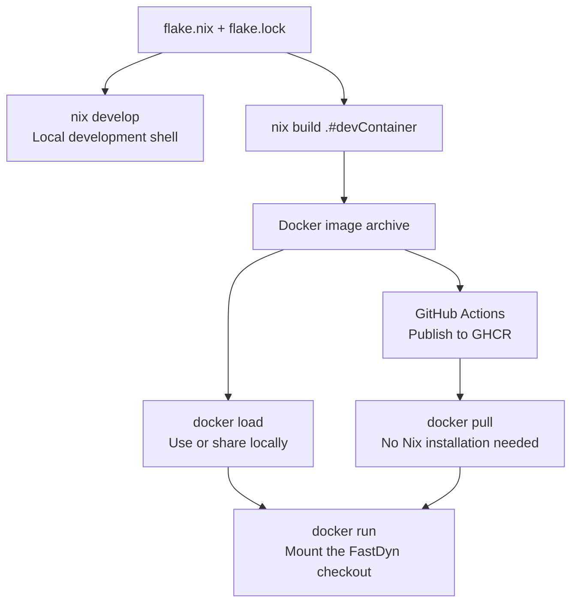

# Build and share the Docker environment with Nix

Use Nix to build the development environment once, then distribute it as a
Docker image. The machine building the image needs Nix; a machine running the
image needs only Docker. This is the same environment as `nix develop`, with
the compilers, patched QEMU, FastDyn tools, Python dependencies, and mdBook.



The image targets **Linux x86-64 (`linux/amd64`)**. It contains the tools;
your source checkout, TOML files, models, and results come from a mounted
directory. It is a development and simulation image, not a preconfigured
long-running simulation service.

## Build and load the image

Follow the [Nix setup](environment.md#option-a-nix) and install
[Docker Engine](https://docs.docker.com/engine/install/). From the FastDyn root:

```bash
nix build .#devContainer --out-link out/dev-container
docker load --input out/dev-container
```

The first command creates a link to a compressed image archive in the Nix
store. The second should print `Loaded image: fastdyn-dev:local`. It does not
publish anything. The first build can take time; later builds reuse unchanged
Nix dependencies. `nix/dev-container.nix` derives the image from the development
shell with `dockerTools.streamNixShellImage`, so there is no second package list
or Dockerfile to maintain.

Check the loaded tools:

```bash
docker run --rm fastdyn-dev:local bash -c \
  'rumoca --version && fastdyn --help && mdbook --version'
```

Expect Rumoca **0.10.0**, FastDyn command help, and mdBook **0.5.2**.

## Run against your checkout

Initialize the [source submodules](environment.md#get-the-sources), then enter:

```bash
docker run --rm -it --user "$(id -u):$(id -g)" \
  --volume "$PWD:/workspace" --publish 5000:5000 --publish 3000:3000 \
  fastdyn-dev:local
```

The shell opens at `/workspace`. The user mapping keeps generated files owned
by your host user. Run `fastdyn-config`, `fastdyn`, and `python` here just as in
the other environments. Keep simulation settings in TOML; the container does
not need environment variables to select a model or mission.

After creating a run configuration inside this environment, you can also run
it directly from the host. For example, the [first mission](../rumoca/getting-started.md)
creates `out/copter.toml`:

```bash
docker run --rm --user "$(id -u):$(id -g)" \
  --volume "$PWD:/workspace" --publish 5000:5000 fastdyn-dev:local \
  fastdyn run -c out/copter.toml -o out/copter/work
```

Regenerate run configurations inside the container when moving from another
machine or environment: generated tool and socket paths describe that runtime.
Results under `out/` remain on the host after `--rm` removes the container.
Run one vehicle at a time with the supplied port assignments.

To view this book from the container:

```bash
docker run --rm -it --user "$(id -u):$(id -g)" \
  --volume "$PWD:/workspace" --publish 3000:3000 fastdyn-dev:local \
  mdbook serve docs --hostname 0.0.0.0
```

Open **http://localhost:3000** on the host. Binding to `0.0.0.0` inside the
container allows Docker's published port to reach mdBook.

## Share an archive or use GHCR

To share the built image without a registry, copy the actual
archive rather than the Nix store symlink:

```bash
cp --dereference out/dev-container out/fastdyn-dev.tar.gz
```

On the receiving machine:

```bash
docker load --input fastdyn-dev.tar.gz
```

Use the `docker run` commands above with a checkout of the same FastDyn revision.

The [publishing workflow](../contributing/container-publication.md) builds
and checks the image on pull requests and publishes it on pushes to `main`.
Same-repository PRs also publish preview tags such as `pr-1`; fork PRs do not publish.
To use the published image instead, run:

```bash
docker pull ghcr.io/jgoppert/fastdyn/dev:latest
```

Replace `fastdyn-dev:local` in the run commands with that image name. For a
repeatable tutorial, use the published `sha-<full-commit>` tag and check out the
matching commit instead of following `latest`. In another repository, the
workflow publishes to `ghcr.io/<owner>/<repository>/dev`, all lowercase.
The build and publication steps are automatic; Pages enablement and package
visibility are the repository settings described in the contributing chapter.
