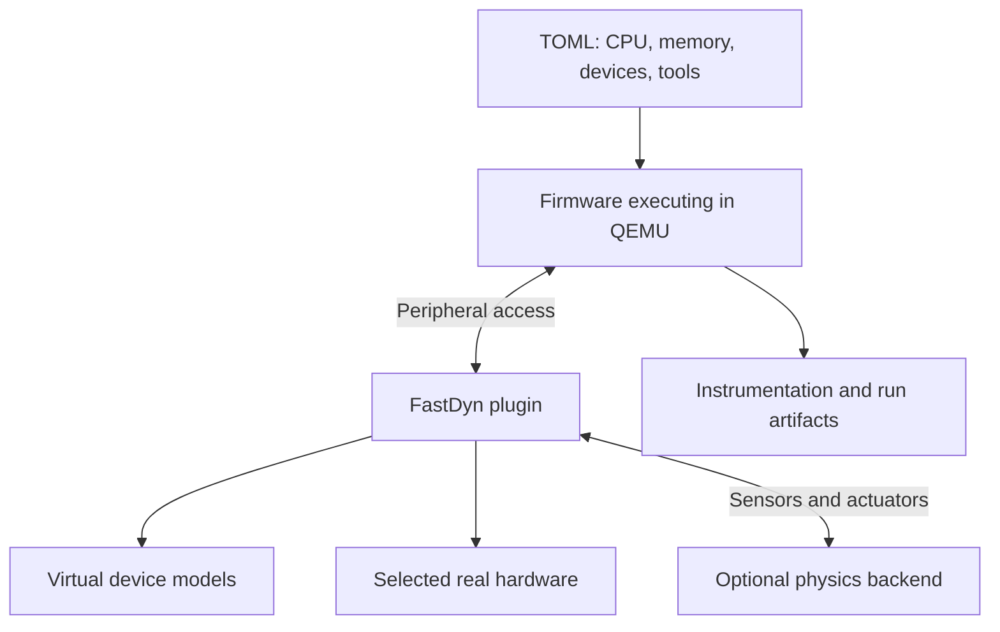

# Architecture and first steps

FastDyn starts with an executable firmware image and a description of its
board. The firmware executes in patched QEMU. FastDyn's plugin routes device
accesses through the models selected in TOML and applies configured virtuals,
modifiers, and instrumentation.



## 1. Inspect a configuration

After [choosing your environment](environment.md), from the repository root:

```bash
fastdyn run --help
```

Expect help beginning with `Runs the firmware on QEMU using the passed config
file`, including required `--config` and optional `--work-dir` arguments.
Your chosen environment supplies tools; the TOML selects the firmware and simulation.

Read `configs/bare_bones.toml` for the configuration shape, then choose a
configuration matching your actual firmware. A starter is not automatically a
correct board model. Review the CPU, memory addresses, vector table, device
ranges, interrupts, and clock assumptions.

## 2. Run a configured target

The general command is:

```text
fastdyn run -c <your-config.toml> -o <your-work-directory>
```

The angle-bracket paths are placeholders. For an executable example with the
included firmware, use the [Rumoca first mission](../rumoca/getting-started.md).

## 3. Inspect the run

The work directory contains generated device routing and virtual/modifier
rules, plus enabled instrumentation output. Compare those generated rules with
your intended configuration before interpreting a failed boot as a firmware
bug. `fastdyn help` opens the configuration-help browser.

For other hardware and native builds, follow `README.md` and `setup.sh --help`.
The supplied simulation environment currently targets x86-64 Linux.
