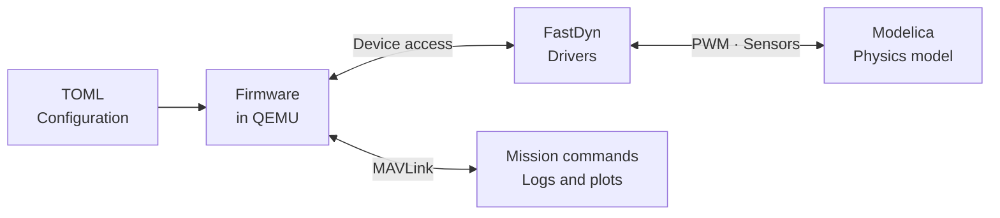

<section class="fd-hero">

FastDyn · Firmware meets physics

<h1>Real firmware. Your vehicle model.</h1>

Connect embedded firmware to a Modelica plant. Change the physics, tune the controller, and follow the results from sensor to trajectory.

</section>

<a class="fd-path" href="rumoca/session.html"><strong>The Rumoca walkthrough</strong>Build a vehicle, fly a mission, and investigate an off-center payload.<b>One hour · Start the walkthrough →</b></a>
<a class="fd-path" href="general/overview.html"><strong>The FastDyn field guide</strong>Understand the runtime, configure a board, and work with devices and virtuals.<b>Reference · Explore FastDyn →</b></a>

FastDyn runs embedded firmware in a configurable QEMU environment. A TOML file
describes the CPU, memory map, firmware, peripherals, instrumentation, and any
external physics model. You can inspect firmware behavior, supply virtual
devices, connect selected hardware, and automate repeatable experiments.

## Follow the signals

The Rumoca examples preserve the firmware's sensor and actuator driver path.
Fidelity comes from the emulated firmware, peripheral behavior, timing, and
plant working together. A detailed firmware simulation still needs a suitable,
validated physical model; an idealized plant does not reproduce every effect
of a real airframe.

To preview this book, run `mdbook serve docs --open` from your chosen development
environment and open **http://localhost:3000**. For a lightweight docs-only setup,
see [preview and publish the book](documentation.md).
