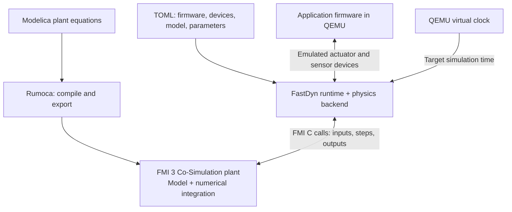
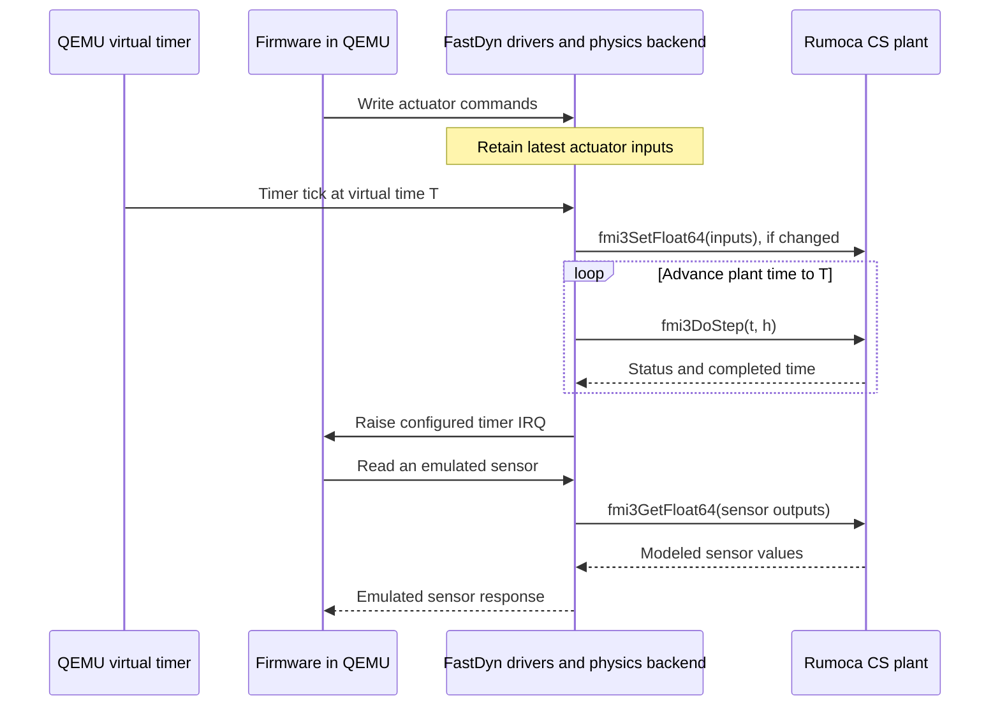

# FMI 3 and FastDyn

**FMI** means **Functional Mock-up Interface**: a standard interface for
exchanging executable simulation models. An **FMU** (Functional Mock-up Unit)
is the packaged model, usually a ZIP archive with an `.fmu` extension. Its
`modelDescription.xml` describes variables and capabilities; its code or native
binary implements the model. Modelica is the modeling language, Rumoca is the
compiler/exporter, and FastDyn imports the result.
[FMI specification](https://fmi-standard.org/docs/3.0.2/#_overview).

## Model Exchange versus Co-Simulation

The distinction is who advances the model's internal state:

| Interface | FMU provides | Importing tool provides | FastDyn's current plant backend |
| --- | --- | --- | --- |
| **Model Exchange (ME)** | Model equations through functions for states, derivatives, outputs, and events | Numerical integration and event handling | Not implemented |
| **Co-Simulation (CS)** | Executable model with its own means of advancing state | Input/output exchange and communication times | **Used for these vehicle models** |
| **Scheduled Execution (SE)** | Model partitions that can be activated separately | A scheduler that activates partitions | Not implemented |

With ME, the importer drives a solver and asks the FMU to evaluate the model.
With CS, it supplies inputs and asks the FMU to advance through a time interval
using `fmi3DoStep`. CS does not require separate computers or a network.
[ME and CS in the specification](https://fmi-standard.org/docs/3.0.2/#_fmi_for_model_exchange_me).

For this tutorial, the Rumoca-generated FMU owns the plant's integration. QEMU
executes the firmware instructions, and FastDyn decides when to exchange values
with the plant. The firmware itself is **not packaged inside the vehicle FMU**.

## Follow the two paths



The FMU's shared library runs **on the host, inside the QEMU plugin process**.
The firmware runs as guest machine code in QEMU. Python prepares the build,
reads metadata, and launches the run; the per-step FMI calls use the C backend.
The firmware's board and device configuration determine how it connects to
the plant. In the vehicle examples, MAVLink supplies mission commands and
telemetry alongside this physics path.

The physics interface remains the same one used by FastDyn's other backends:
actuator writes, sensor reads, and an `advance_simulation` operation. Firmware
sensor and actuator drivers still execute through the configured device path.
Changing a Modelica force equation therefore changes what those sensors see.

## What happens during a run

1. **Prepare the plant.** `[FMU]` selects a named model. FastDyn invokes Rumoca
   when a build is needed and reads value references from `modelDescription.xml`.
   A value reference is the numeric handle used by FMI calls for a named variable.
   For a source-code FMU, FastDyn builds the host library from the FMI build
   description using FMPy and CMake. An adjacent `.runtime` directory caches
   that library and the resources; changed archive contents invalidate it.
2. **Load and initialize.** The C backend loads the generated native library,
   calls `fmi3InstantiateCoSimulation`, enters initialization, applies the TOML
   parameters with `fmi3SetFloat64`, reads neutral PWM defaults, and exits
   initialization.
3. **Exchange values.** Actuator writes update the four-element `pwm` input.
   At each configured timer tick, FastDyn advances the plant to QEMU's virtual
   time before raising the firmware IRQ. It supplies changed inputs and calls
   `fmi3DoStep`. Sensor reads retrieve the resulting outputs using
   `fmi3GetFloat64` and expose them through FastDyn's device models.
4. **Finish.** For an orderly backend shutdown, its shutdown hook calls the
   termination/free functions and releases the shared library.



The example board's timer IRQ is **1 ms**. The FMU backend also caps each FMI
communication step at **2 ms**, splitting a larger requested interval when
needed and taking a smaller final step to reach the target time. That cap is an
implementation constant, not a TOML option or the FMU's internal solver step.
Sensor drivers can read the latest plant state at their own rates. Faster or
slower host execution changes wall time, while coupling uses QEMU virtual time.

## Current vehicle backend interface

The diagrams describe the firmware-to-plant coupling. The current vehicle
backend implements the specific signal contract below; using another firmware
requires compatible device mappings and a plant wrapper that matches it.

| Signal | Direction at the FMU | Shape and units |
| --- | --- | --- |
| `pwm` | Input | Four channels, pulse width in microseconds |
| `accel`, `gyro` | Output | Three body-FRD components; m/s² and rad/s |
| `mag` | Output | Three body-FRD components, Gauss |
| `gps` | Output | Latitude and longitude in degrees, altitude in meters |
| `vel_ned` | Output | North/east/down velocity in m/s |
| `yaw_deg` | Output | Heading in degrees |
| `baro_altitude_m` and related barometer outputs | Output | Altitude, pressure, temperature, and climb rate |

The wrappers also expose origin parameters such as `lat0`, `lon0`, and
`ground_alt_wgs84`. FMI 3 supports arrays; FastDyn passes these vector signals
and fixed-size numeric parameter arrays through `Float64` accessors. The
[Modelica chapter](modelica.md) shows the FLU-to-FRD and local-to-geodetic
conversions in the actual wrapper.

## Inspect the artifact yourself

After [preparing and running the first mission](getting-started.md), save this
Python code as `out/inspect_fmu.py`:

```python
from fmpy import read_model_description

model = read_model_description("out/fmi3/Copter/FastDyn_Copter.fmu")

print("FMI version:", model.fmiVersion)
print("Model Exchange:", model.modelExchange is not None)
print("Co-Simulation:", model.coSimulation is not None)
print("Scheduled Execution:", model.scheduledExecution is not None)

for variable in model.modelVariables:
    if variable.name in ("pwm", "accel", "gyro"):
        dimensions = [dimension.start for dimension in variable.dimensions]
        print(variable.name, variable.causality, variable.valueReference, dimensions)
```

Run it from the repository root in your chosen environment:

```bash
python out/inspect_fmu.py
```

For this Copter, expect FMI version `3.0`, **Model Exchange: True**,
**Co-Simulation: True**, and **Scheduled Execution: False**. The printed shapes
are `[4]` for PWM and `[3]` for acceleration and angular rate. Numeric value
references may change when the model or compiler changes; read them from the
metadata instead of copying constants into a driver. This FMU advertises both
ME and CS; FastDyn selects its CS interface. Advertising ME does not mean
FastDyn uses an ME solver.

## Current scope and limitations

This is a **CS plant backend with the PWM/sensor contract above**. It extracts
the packaged FMU and reads the Co-Simulation library identifier and instantiation
token from its metadata. It can reuse a host binary or compile a source FMU;
the portable source archive is retained unchanged. The current development
image supports x86-64 Linux. An arbitrary FMU still needs compatible variables
and execution capabilities to work with this vehicle backend.

The importer disables FMI event mode and early return at instantiation and
provides no intermediate-update callback. It does not implement ME integration,
Scheduled Execution, rollback, or a general multi-FMU coupling algorithm. A
model needing those facilities requires importer/exporter work as well as a
valid Modelica model. FMI compliance by itself does not establish that its
signals or capabilities fit this backend.

The current Plane fails **during Rumoca FMI export** because its ground-contact
condition introduces continuous state-event indicators. The compiler now
supports the quadrotor template's parameter assertions and array operations;
the remaining Plane limitation is separate. The standard's support for events
does not mean the current exporter and FastDyn integration implement every
event feature. Plane is therefore marked as pending support in this walkthrough.

For implementation details, see `src/fastdyn/fmu_build.py` (export and metadata),
`src/fastdyn/fmu_runtime.py` (native build and artifact preparation),
`virtuals/physics/phy.h` (the backend abstraction), `virtuals/virtuals.c`
(the timer-tick coupling), and
`virtuals/physics/physics_engines/fmu/fmu.c` (native FMI calls and stepping).
