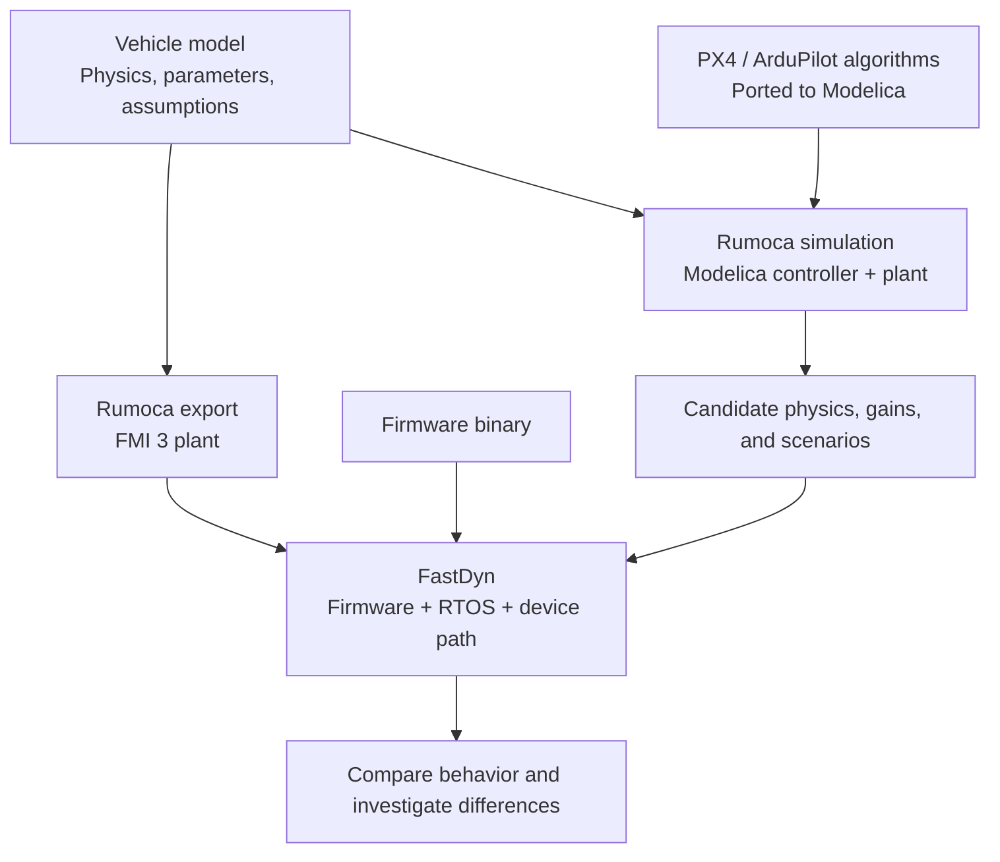

# Model library and simulation roadmap

The longer-term aim is to reuse a vehicle's physical model across quick
controller experiments and detailed firmware validation. `modelica_models`
supplies the physical and control building blocks; Rumoca compiles Modelica;
FastDyn connects an exported plant to executing firmware.

## Templates and complete vehicle models

The pinned [modelica_models library](https://github.com/CogniPilot/modelica_models/tree/dfdb3294f61ab639a8a8be19611a1f69187a3ff7)
contains more than generic templates:

| Starting point | Examples in the library | Use it when |
| --- | --- | --- |
| Plant template | `Vehicles.Templates.QuadrotorPlant`, `FixedWingPlant` | You know the vehicle's parameters and need a reusable physical structure |
| Named vehicle plant | `Vehicles.Rdd2.Plant`, `Vehicles.Cubs2.Plant` | An existing vehicle is close to yours |
| Closed-loop vehicle and mission | RDD2 controller and waypoint missions; CUBS2 closed-loop vehicle | You want to study a controller and plant together |
| Building blocks | `RigidBody`, `Control`, `Estimation`, `Avionics` | Your physics or control architecture needs different components |

“Complete” means a model can combine a plant, controller, and scenario; it does
not mean every physical effect or firmware detail is represented. For example,
the CUBS2 closed-loop model explicitly uses a surrogate for its unavailable
onboard stabilizer. Check each model's stated assumptions and tests.

In this tutorial, `FastDyn.Copter` adapts a template to FastDyn's
actuator/sensor interface, and `FastDyn.Qavr` gives it a named parameter set.
The side-load model then changes the applied-force equations. That progression
is useful for your own vehicle: reuse a nearby model, record your measured
parameters, then extend the equations where needed.

## Two ways to execute the control loop

The PX4 and ArduPilot porting work brings flight-control algorithms into
Modelica so a controller and plant can be simulated together outside FastDyn.
Abstracting the RTOS and hardware interfaces removes execution work from the
simulation and allows faster algorithm experiments. This is a complementary
path under development, rather than a new firmware target supplied by this
tutorial.

| Question | Modelica controller + plant | Firmware in FastDyn |
| --- | --- | --- |
| What runs the controller? | A Modelica representation of its algorithms | The compiled firmware binary in QEMU |
| How is scheduling represented? | Modeled sample times and task ordering; RTOS details are abstracted | Firmware RTOS behavior within the emulated machine |
| How do sensors and actuators connect? | Model signals and explicit sampling assumptions | FastDyn's modeled peripherals and firmware driver path |
| What is it useful for? | Exploring physics, gains, and many candidate scenarios quickly | Checking that candidates work with the firmware implementation |
| What can a pass establish? | Behavior of the modeled algorithms and assumptions | Behavior of that firmware, plant, and emulated-machine configuration |

The direct Modelica route has lower **firmware execution fidelity**: it can
omit scheduling effects, driver interactions, and implementation details that
matter in the deployed software. The plant itself need not be less detailed
if both routes use the same physical equations. FastDyn still models hardware;
it does not automatically reproduce every board timing or real sensor effect.

Speed depends on the model, solver, sampling rates, and execution path. This
book does not yet provide a side-by-side speed benchmark or establish complete
PX4/ArduPilot behavioral parity. The controller ports are separate work; the
library's existing RDD2/CUBS2 controllers should not be mistaken for those
ports or for a complete port of either autopilot.

## Planned workflow

1. Keep reusable templates, named vehicles, units, frame conventions, and
   measured data together in the library.
2. Use Modelica controller ports for fast experiments on candidate physics,
   gains, and disturbance scenarios.
3. Carry the selected plant, initial conditions, gains, and scenario into
   FastDyn, retaining equivalent actuator and sensor assumptions.
4. Compare trajectories and controller signals. Investigate differences in
   sampling, scheduling, numerical integration, interfaces, and algorithm
   coverage before accepting the result.

Shared model interfaces, reproducible comparison cases, and documented port
coverage are part of this roadmap. Each new compiler/library combination also
needs export and runtime checks: a model's presence in the library does not
guarantee that every Rumoca target supports it. In particular, the tutorial's
[Plane contact-event limitation](index.md) still applies.

When choosing your next experiment, ask whether you need to study a physical
effect, a control algorithm, or its implementation in firmware. Start with a
library model close to your vehicle, record its assumptions, and use the
[first mission](getting-started.md) and [payload study](monte-carlo.md) as
patterns for testing your changes in FastDyn.
