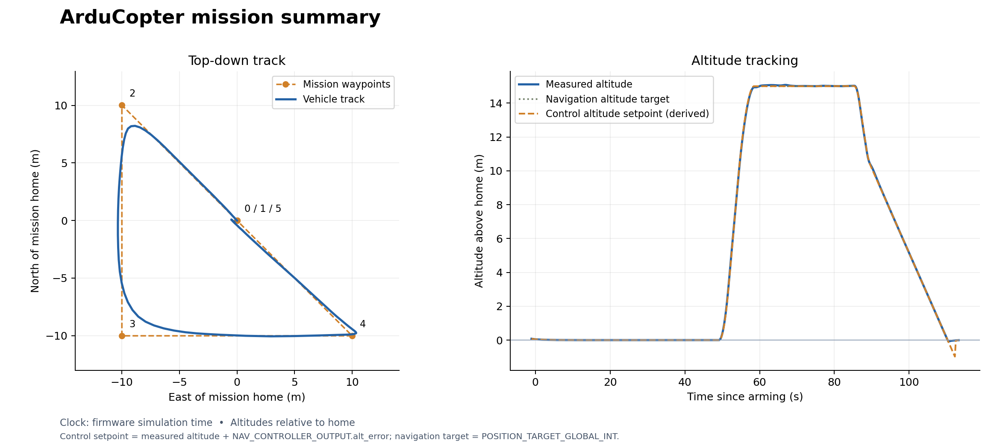
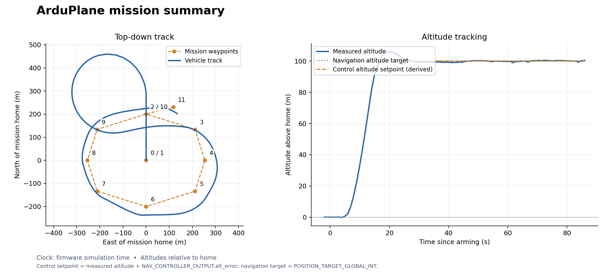
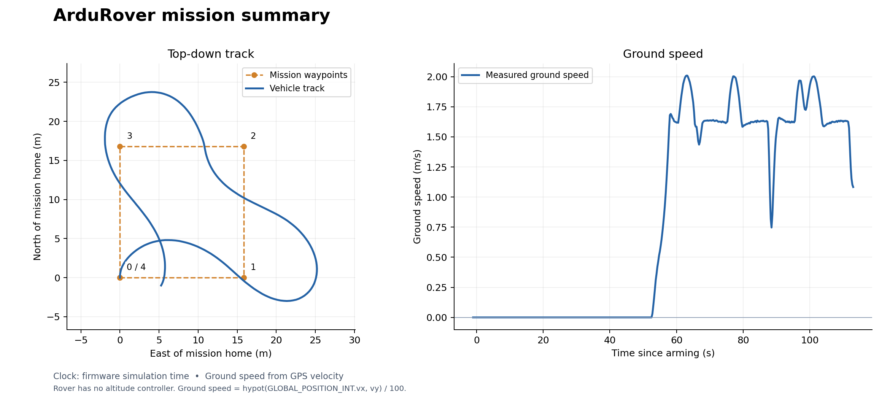

# Mission logs, plots, and models

Explore recorded [ArduCopter](#arducopter), [ArduPlane](#arduplane), and
[ArduRover](#ardurover) missions below. Drag a time slider, click the lower plot,
or press **Replay**. Each panel has its own controls. The gray track shows the
complete route, the blue trace advances with time, and the red marker shows
the selected sample. Numbered points are the uploaded mission waypoints.

The Copter and Rover recordings use this checkout's pinned compiler and
array-based models. Their downloadable summaries record source revisions and
model hashes. Plane is a historical recording: the current three-wheel model
is included in the repository, but its FMI export awaits compiler event support.

| Vehicle | Completion check | Model status |
| --- | --- | --- |
| ArduCopter | Final mission item, low altitude, and firmware `ON_GROUND` | Current model, rerun successfully |
| ArduRover | Final waypoint 4 reached | Current model, rerun successfully |
| ArduPlane | Waypoint 11 reached while airborne | Historical recording; current model not flight-validated |

The console logs confirm completion independently of the trajectory plot.

## ArduCopter

The 500 mm quadrotor takes off, visits its waypoints, and lands. Compare measured
altitude with the derived controller setpoint using the checkbox.

<div class="mission-explorer" data-src="../assets/baseline-mission.json">Loading Copter telemetry…</div>

<details><summary>Static Copter trajectory and altitude figure</summary>



</details>

[SVG](../assets/baseline-mission.svg) · [CSV](../assets/baseline-mission.csv) ·
[MAVLink log](../assets/baseline-mission.tlog) · [Console log](../assets/baseline-mission-console.txt) ·
[Mission file](../assets/baseline-mission.waypoints) · [Run summary](../assets/baseline-mission-summary.json)

<details><summary>Model used for this run: FastDyn.Copter</summary>

```modelica
{{#include ../assets/baseline-mission.mo}}
```

</details>

The wrapper maps four PWM commands to motor speeds and connects
`Vehicles.Templates.QuadrotorPlant` to FastDyn's sensor interface. See the
[model walkthrough](modelica.md) for its array parameters and equations.

```bash
fastdyn-config --base configs/copter462.toml --output out/copter.toml
fastdyn run -c out/copter.toml -o out/copter/work
```

## ArduPlane

**Historical result:** the fixed-wing aircraft starts stationary, takes off to 100 m, and flies a
waypoint circuit. This run ends after **waypoint 11 is reached** while the
plane is still airborne. It demonstrates takeoff and navigation; automatic
landing has not been tested by this mission.

<div class="mission-explorer" data-src="../assets/plane-mission.json">Loading Plane telemetry…</div>

<details><summary>Static Plane trajectory and altitude figure</summary>



</details>

[SVG](../assets/plane-mission.svg) · [CSV](../assets/plane-mission.csv) ·
[MAVLink log](../assets/plane-mission.tlog) · [Console log](../assets/plane-mission-console.txt) ·
[Mission file](../assets/plane-mission.waypoints) · [Run summary](../assets/plane-mission-summary.json)

<details><summary>Model used for this run: FastDyn.Plane</summary>

```modelica
{{#include ../assets/plane-mission.mo}}
```

</details>

The archived wrapper uses an earlier plant with a single ground contact.
Its exact source and revision are preserved in the downloads above; it does
not represent the new three-wheel landing gear.

The current [Plane model and configuration](configs.md#plane-462) instantiate
`Vehicles.Templates.FixedWingPlant` with two main wheels and a tailwheel.
The pinned compiler lowers this model but rejects FMI export of its contact
events. CI checks that boundary explicitly. Wait for event support and a new
flight validation before using this model for an ArduPlane exercise.

## ArduRover

The rover follows four waypoints around a rectangle. The lower plot shows
**ground speed**, derived from the horizontal GPS velocity, because Rover
has no altitude controller. This recording's home-altitude reference
was zero while its GPS altitude was near 149 m; its `relative_alt` field must
not be interpreted as the rover hovering 149 m above the ground.

<div class="mission-explorer" data-src="../assets/rover-mission.json">Loading Rover telemetry…</div>

<details><summary>Static Rover trajectory and speed figure</summary>



</details>

[SVG](../assets/rover-mission.svg) · [CSV](../assets/rover-mission.csv) ·
[MAVLink log](../assets/rover-mission.tlog) · [Console log](../assets/rover-mission-console.txt) ·
[Mission file](../assets/rover-mission.waypoints) · [Run summary](../assets/rover-mission-summary.json)

<details><summary>Model used for this run: FastDyn.Rover</summary>

```modelica
{{#include ../assets/rover-mission.mo}}
```

</details>

Steering comes from PWM channel 1 and signed throttle from channel 3. The
wrapper connects them to `Vehicles.Templates.RoverPlant` and exposes the same
sensor interface to the firmware. See the [complete Rover TOML](configs.md#rover-462).

```bash
fastdyn-config --base configs/rover462.toml --output out/rover.toml
fastdyn run -c out/rover.toml -o out/rover/work
```

Run the vehicle examples one at a time; their default ports are shared.

## Rebuild the reports from these recordings

The book includes the original telemetry and uploaded waypoint files, so you
can regenerate the figures without rerunning a simulation. In your chosen environment,
from the repository root:

```bash
python -m fastdyn.mission_report --vehicle copter \
  --log docs/book/assets/baseline-mission.tlog \
  --mission docs/book/assets/baseline-mission.waypoints \
  --output out/reports/copter.png --require-setpoint

python -m fastdyn.mission_report --vehicle plane \
  --log docs/book/assets/plane-mission.tlog \
  --mission docs/book/assets/plane-mission.waypoints \
  --output out/reports/plane.png --require-setpoint

python -m fastdyn.mission_report --vehicle rover \
  --log docs/book/assets/rover-mission.tlog \
  --mission docs/book/assets/rover-mission.waypoints \
  --output out/reports/rover.png
```

Each command prints a JSON summary and writes PNG, SVG, CSV, and JSON files
under `out/reports/`. Plane and Rover finish at mission items 11 and 4. Copter can reset its mission cursor after landing; use the console completion marker and on-ground telemetry as the success check.
`--require-setpoint` checks that controller altitude telemetry was recorded;
it is used for Copter and Plane.

For these Copter and fixed-wing Plane runs, the derived altitude setpoint is
`GLOBAL_POSITION_INT.relative_alt / 1000 + NAV_CONTROLLER_OUTPUT.alt_error`.
Position and controller messages are paired by firmware time, so the estimate
can show small timing errors. `POSITION_TARGET_GLOBAL_INT`, when present,
provides a separate navigation target; the static plots include it after
conversion from absolute altitude using home altitude. It can differ from the
controller's intermediate target during takeoff or climb. Rover sends zero for
`alt_error`; the report does not turn that placeholder into an altitude setpoint.

## Record your own run

`fastdyn-config` configures MAVProxy to write `out/<vehicle>/mission.tlog` beside
the generated TOML's other run files. Capture console output as well:

```bash
fastdyn run -c out/copter.toml -o out/copter/work > out/copter/console.log 2>&1
```

Use your new `.tlog` and the waypoint file actually uploaded to the vehicle as
the report inputs. Select `--vehicle plane`, `--vehicle rover`, or `--vehicle copter`
to get the correct title and plotted quantity.

CI runs complete Copter and Rover missions and reports the pending Plane export support separately. Download **mission-report**
from a successful **CI** run for the telemetry, console logs, and summary plots.
**ci-logs** contains additional build and runtime diagnostics.
