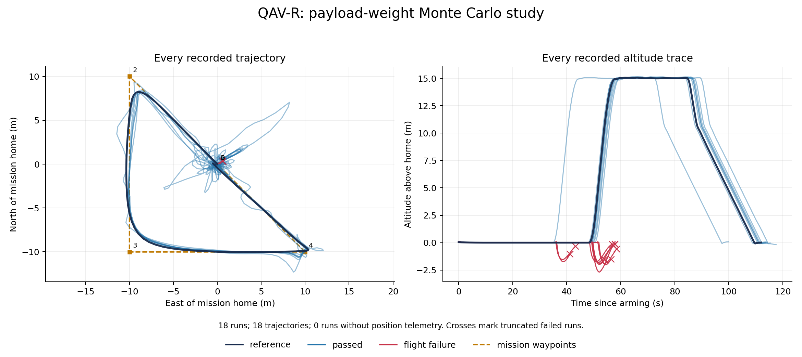

# Payload Monte Carlo study

Continue the [load-at-a-motor experiment](payload.md): **how much prescribed
payload weight can the fixed controller tolerate on the same waypoint mission?**
Vary the payload mass used in `F = m g`, keeping its attachment at the
**front-right motor**, 77.8 mm forward and 77.8 mm right of the center, in the
motor plane. The QAV-R's own mass, inertia,
geometry, motors, firmware, gains, and mission stay fixed.

The recorded batch contains **18 runs: nine completed missions (including the
unloaded reference) and nine firmware crash disarms**. The heaviest successful
sample was **321.6 g**; the lightest failed sample was **359.8 g**. These are
observations for this mission and controller, not an exact stability boundary.
The plant models ground contact at landing points; motion after tipping is not
a detailed airframe collision reconstruction.

Start with the recorded trajectories below. For a short hands-on check, run
the zero-load reference in step 4. The complete batch is an optional longer
experiment; you can replot its archived logs immediately using step 6.

## 1. Inspect the recorded flights

<div class="ensemble-explorer" data-src="../assets/payload-study/trajectories.json">Loading recorded payload-study trajectories…</div>

Every recorded trajectory is shown on common axes. The zero-load reference is
dark, completed missions are blue, and flights stopped by a failure criterion
are red. Select a mass to highlight that run; the other paths remain visible.
Crosses mark the final sample of interrupted runs. Runs without position
telemetry remain in the table.

<details><summary>Static plot of all trajectories and altitude traces</summary>



</details>

{{#include ../assets/payload-study/results.md}}

Peak armed tilt includes takeoff and ground contact. The separate sustained-tilt
stop criterion activates only after the vehicle has risen above 2 m. The
firmware's own crash check can disarm it before that height.

[Download SVG](../assets/payload-study/trajectories.svg) ·
[All trajectory data](../assets/payload-study/trajectories.json) ·
[Run manifest](../assets/payload-study/runs.toml) ·
[Study settings and controller gains](../assets/payload-study/study.toml) ·
[Model library license](../assets/payload-study/LICENSE-modelica_models)

### Which model produced these results?

Each trial extends the same `FastDyn.QavrSidePayload` model from the preceding
chapter and uses the environment's pinned Rumoca compiler. The QAV-R geometry,
array-valued inertia, motor response, and selected controller gains stay fixed.
Only the prescribed payload mass changes. The run manifest records source and
compiler provenance alongside the measured results.

<details><summary>Generated zero-load QAV-R variant</summary>

```modelica
{{#include ../assets/payload-study/reference/PayloadTrial.mo}}
```

</details>

## 2. Understand the sampled quantity

The primary model exposes the scalar `payload_mass` in kilograms:

```modelica
{{#include ../../../modelica/FastDyn/QavrSidePayload.mo}}
```

At level attitude, a 50 g mass gives a downward force of 0.49 N and a positive
body-FLU roll moment and pitch moment of approximately 0.0381 N m each. A 100 g
mass doubles both. The force remains world-down as the aircraft tilts.
Each trial compiles its own FMU so the load
also reaches any derived expressions evaluated during compilation.

This study uses a zero-load reference, **16 uniformly sampled masses from
0 to 500 g**, and an explicit **500 g upper-limit run**. NumPy's PCG64 generator
uses seed **462**. The upper limit is **100% of the original 500 g vehicle
weight**: `payload_mass / vehicle_mass <= 1.0`. At this endpoint the combined
static weight is equivalent to 1.0 kg under gravity. The uniform distribution
explores the selected range; it does not estimate how frequently real payload
masses occur.

This is the external-load approximation from the preceding chapter: changing
`payload_mass` changes the prescribed weight, **not the vehicle's inertial
mass**. It does not simulate the payload's swinging or acceleration-dependent
tension. Those require additional dynamics.

## 3. Predict the trend before running

More payload weight requires more total thrust and more unequal motor effort.
Let `W = 0.50 * 9.8` be the original vehicle weight and `P = payload_mass * 9.8`
be the applied load. Balancing total thrust, roll, pitch, and yaw at level hover
for this square-X motor layout gives:

```text
T1 (front-right, payload motor) = (W + 3 P) / 4
T2 (rear-left, opposite motor)  = (W - P) / 4
T3 (front-left) = T4 (rear-right) = (W + P) / 4
```

At 500 g of payload, the force is **4.90 N**, with **0.381 N m** of roll moment
and the same pitch moment. The ideal allocation is **4.90 N, 0 N, 2.45 N,
2.45 N** for motors 1–4. Motor 2 reaches zero thrust, leaving no room to reduce
it further. This motivates testing the endpoint: transients and the fixed
controller may lose control before or near that condition.

## 4. Run the experiment

Use your [chosen environment](../general/environment.md):

<!-- fastdyn-check: payload-reference -->
```bash
fastdyn-config --base configs/copter462.toml \
  --overlay configs/models/qavr-side-payload.toml --output out/payload-base.toml
python utils/payload_study.py --config configs/monte-carlo/payload.toml \
  --run-config out/payload-base.toml --limit 1
```

The reference run should report:

```text
[study] reference: payload 0.0 g
[study] reference: reference — Final mission item and landing confirmed
```

Remove `--limit 1` to run the full batch. The runner resumes completed samples
in the same output directory and refuses to mix changed experiment inputs.
Choose a fresh output directory when changing the study or controller. Run one
batch at a time because the configured MAVLink ports are shared.

The runner snapshots the current model sources and generates each trial's Modelica class.
Edit the study TOML to change sweep settings; the runner replaces generated
trial sources. Develop a
different force law in a separately maintained model and validate it before
automating its trials.

All persistent settings, including controller parameters, are in TOML:

```toml
{{#include ../../../configs/monte-carlo/payload.toml}}
```

Expect a Modelica variant, compiled FMU, controller parameter file, run TOML,
console log, MAVLink log, and `result.json` for each trial. The `publish`
setting is optional and is empty by default, so your one-run check
does not replace the book's archived results. Find the new figures under
`out/payload-experiment/report/`. To publish a reviewed full batch into this
book, set `publish = "docs/book/assets/payload-study"` before starting a fresh
output directory.

## 5. Interpret the outcomes

Every run starts fresh firmware and separate RAM files, then loads the same
controller parameters. Completing the Copter mission requires the final item
and landing confirmation. FastDyn and its separate helper processes are stopped
before the next trial starts.

The experiment stops a flight if sampled tilt exceeds **60° across at least
1 s** after becoming airborne, altitude exceeds **50 m**, or the firmware
reports crash disarming. Tilt is `acos(cos(roll) * cos(pitch))`; this uses the
recorded MAVLink samples and does not certify behavior between samples.

A flight that arms but misses the completion deadline is **mission incomplete**.
A compiler or startup failure is a **run error**. These labels distinguish an
observed flight failure from an unavailable simulation; a timeout alone does
not establish instability. Partial failed-run trajectories are retained.

A finite Monte Carlo sample can reveal failures at particular masses. It cannot
prove an exact stability boundary or establish that every unsampled mass will
work. To refine a transition, narrow the mass interval in TOML, use a new output
directory, and repeat with the same controller.

## 6. Replot the archived logs

In your chosen environment, regenerate the plot from the book's saved measurements:

<!-- fastdyn-check: payload-replot -->
```bash
python utils/monte_carlo_report.py \
  --config docs/book/assets/payload-study/runs.toml \
  --output out/payload-replot
```

The command reports the total number of runs, available trajectories, and runs
without position telemetry. Both interactive and static figures include every
available path, including interrupted flights.
