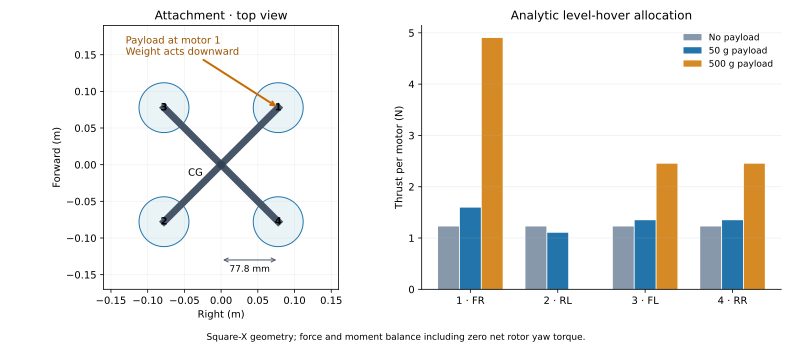
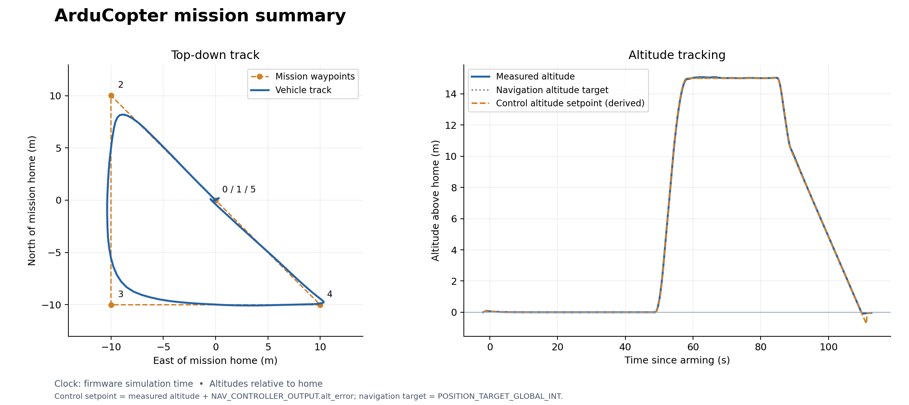
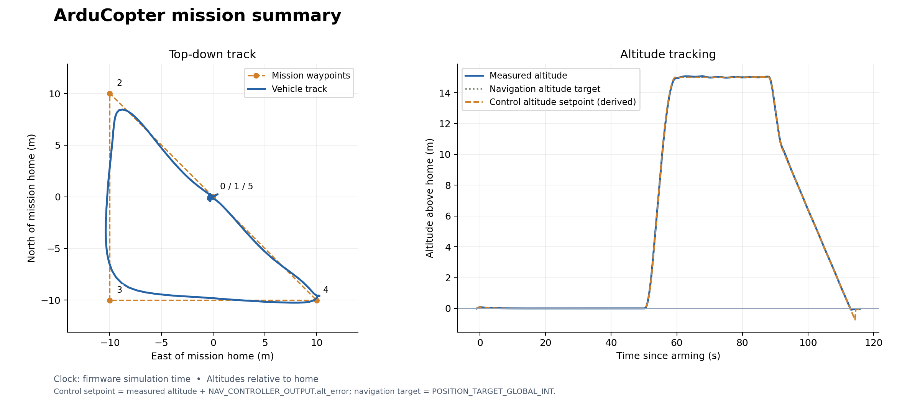

# Apply a load at the front-right motor

Use a **50 g payload mass to prescribe a 0.49 N downward force** at the
front-right motor (motor 1). In the assumed square-X layout, this is 77.8 mm
forward and 77.8 mm right of the center, in the motor plane. The QAV-R's mass
and inertia stay at their original values. You will convert mass to weight,
rotate the force into body coordinates, then compute its moment.



## 1. Read the complete load model

```modelica
{{#include ../../../modelica/FastDyn/QavrSidePayload.mo}}
```

`force_world` is expressed in world **north, west, up**, so its negative Z
component points down. `attachment_b` is expressed in body **forward, left, up**,
so negative Y puts the attachment on the right. `plant.R` rotates body vectors
to world coordinates; its transpose converts the world force into body axes.
The force therefore stays world-down when the vehicle tilts.

The applied weight is `payload_mass * plant.gravity`. Its moment follows the
familiar lever-arm relation:

\[
M_b = r_b \times F_b.
\]

With a level vehicle and the default 50 g payload mass:

```text
force_b  = {0, 0, -0.49} N
moment_b = {0.038113, 0.038113, 0} N m
```

The moment is about the existing vehicle CG. Apply the force and moment once;
there is no additional mass, CG shift, or inertia correction in this example.

## 2. See where the force enters the physics

The library template at the pinned revision sums its forces internally and
does not yet expose external-load inputs. FastDyn keeps a local adaptation,
`modelica/FastDyn/QuadrotorWithExternalWrench.mo`, of
`Vehicles.Templates.QuadrotorPlant`. It adds two body-frame inputs and adds them
to the force and moment sums before rigid-body integration:

```modelica
{{#include ../../../modelica/FastDyn/QuadrotorWithExternalWrench.mo:applied-wrench}}
```

The normal Copter and QAV-R models bind those inputs to zero. `QavrSidePayload`
binds them to the force and moment computed above. Motor response, drag, ground
contacts, and the rigid-body equations still come from the template design.
This changes plant physics while preserving FastDyn's PWM and sensor interface.

<details><summary>Complete quadrotor template with external-load inputs</summary>

```modelica
{{#include ../../../modelica/FastDyn/QuadrotorWithExternalWrench.mo}}
```

</details>

## 3. Choose the load in TOML

```toml
{{#include ../../../configs/models/qavr-side-payload.toml}}
```

In your chosen environment, generate the configuration:

```bash
fastdyn-config --base configs/copter462.toml \
  --overlay configs/models/qavr-side-payload.toml \
  --overlay configs/models/qavr-controller.toml --output out/payload.toml
```

Expected output begins `Created out/payload.toml`. The selected class is
`FastDyn.QavrSidePayload`. Set `payload_mass = 0.0` for no load or
`payload_mass = 0.10` for a 100 g payload's weight. Change `attachment_b` to
move the attachment point. Keep these choices in the overlay TOML.
The controller overlay uses `out/qavr-controller.param`, exported in the
[gain-tuning chapter](tuning.md#4-use-the-selected-gains-for-a-mission).
The attachment coordinates are independent parameters so FMI can accept the
TOML override; if you change the frame geometry, update the attachment too.

## 4. Predict, then check the response

At level hover, total rotor thrust must rise from 4.90 N to 5.39 N. The
front-right load creates both roll and pitch moments. Balancing those moments
and the rotor yaw torques predicts the following thrusts for the 50 g example:

| Motor | Position | Predicted thrust |
| --- | --- | ---: |
| 1 | Front-right, at the payload | 1.593 N |
| 2 | Rear-left, diagonally opposite | 1.103 N |
| 3 | Front-left | 1.348 N |
| 4 | Rear-right | 1.348 N |

The diagonally opposite motor reduces thrust while the other motors increase
it. These are analytic level-hover predictions, not measured mission results.
The next chapter derives the allocation and compares missions with larger loads.

Use your unloaded QAV-R mission as the baseline. Check the roll and pitch moment
directions above, then run the same mission with the constant load and fixed
controller gains:

```bash
fastdyn run -c out/payload.toml -o out/payload/work
```

The recorded run completed its waypoints and landed with the same selected
controller as the unloaded QAV-R. Explore its measured trajectory and altitude:

<div class="mission-explorer" data-src="../assets/physics-edit/payload.json">Loading constant-load mission…</div>

<details><summary>Static constant-load trajectory and altitude plot</summary>



</details>

[Telemetry](../assets/physics-edit/payload.tlog) ·
[Console log](../assets/physics-edit/payload-console.txt) ·
[CSV](../assets/physics-edit/payload.csv) ·
[Run provenance](../assets/physics-edit/payload.toml)

## 5. Change an equation, rebuild, and fly

Now model a **smoothly varying downward tension**, instead of constant weight.
This changes the force law while retaining the same motor geometry, firmware,
controller, and sensor interface. Create your own source file:

```bash
cp modelica/FastDyn/QavrSidePayload.mo modelica/FastDyn/MyLoad.mo
```

Open `modelica/FastDyn/MyLoad.mo` in your editor. Rename the opening
`model QavrSidePayload` and closing `end QavrSidePayload;` to `MyLoad`. Before
the `equation` section, add:

```modelica
parameter Real modulation = 0.5 "Fractional change about mean tension";
parameter Real period = 5.0 "Tension period [s]";
```

Replace the constant `force_world` equation with:

```modelica
force_world = {0, 0, -payload_mass * plant.gravity *
  (1 + modulation * sin(2 * pi * time / period))};
```

Keep `period > 0` and `0 <= modulation <= 1`. At the defaults, the downward
force varies from **0.245 N to 0.735 N**, with a mean of 0.49 N. It should be
largest at 1.25 s and smallest at 3.75 s. `time` is simulation time, not wall
time; the applied tension also varies before takeoff.

Save this complete overlay as `out/my-load.toml`:

```toml
[FMU]
active = "my_load"

[FMU.models.my_load]
model = "FastDyn.MyLoad"
model_file = "modelica/FastDyn/MyLoad.mo"
source_roots = ["modelica", "third_party/common/modelica_models"]
output = "out/fmi3/MyLoad"
build = true

[FMU.models.my_load.parameters]
payload_mass = 0.05
modulation = 0.5
period = 5.0
```

Build and check the actual force before flying:

```bash
fastdyn-config --base configs/copter462.toml --overlay out/my-load.toml \
  --overlay configs/models/qavr-controller.toml --output out/my-load-run.toml
python utils/build_fmi3_fmu.py --config out/my-load-run.toml --skip-submodules
python tests/integration/payload_model_test.py out/fmi3/MyLoad/FastDyn_MyLoad.fmu
fastdyn run -c out/my-load-run.toml -o out/my-load-run/work
```

Expect an FMU named `FastDyn_MyLoad.fmu`, force checks of **0.735, 0.490,
0.245, and 0.490 N** at 1.25, 2.5, 3.75, and 5 s, and a mission ending with
`final landing confirmed near ground`. The native check also verifies that
the vehicle's inertial mass remains 0.5 kg and the moment is `r × F`.

The complete reference implementation is `FastDyn.QavrVaryingLoad` below.
Its recorded mission uses the same new equation and selected gains:

<details><summary>Complete varying-tension model</summary>

```modelica
{{#include ../../../modelica/FastDyn/QavrVaryingLoad.mo}}
```

</details>

<div class="mission-explorer" data-src="../assets/physics-edit/varying.json">Loading varying-load mission…</div>

<details><summary>Static varying-load trajectory and altitude plot</summary>



</details>

[Telemetry](../assets/physics-edit/varying.tlog) ·
[Console log](../assets/physics-edit/varying-console.txt) ·
[CSV](../assets/physics-edit/varying.csv) ·
[Run provenance](../assets/physics-edit/varying.toml)

Compare the two altitude traces and waypoint paths, then change the modulation
or period in your overlay and repeat. The native force check verifies the
compiled equation at its default parameters, even when the controller rejects
much of the disturbance in flight.
Keep both run logs; a similar-looking trajectory does not mean the plant stayed
the same. This is the edit → compile → check → run → compare workflow to reuse
for your own physics.

## What this approximation represents

This model exactly describes a prescribed external force at a body attachment
point, such as an idealized tension load. Its 0.49 N downward force also equals
the weight of 50 g under the model's 9.8 m/s² gravity, so it approximates that
payload's static hover load.

A real attached payload also resists linear and angular acceleration. A freely
hanging payload can swing and change the applied tension. Those effects require
additional payload dynamics or changes to the combined mass properties. Keep
this exercise focused on an external disturbance; do not use it to claim
accurate payload motion during aggressive maneuvers. Next, the
[payload Monte Carlo study](monte-carlo.md) varies this same payload mass while
holding the attachment point, vehicle properties, and controller fixed.
