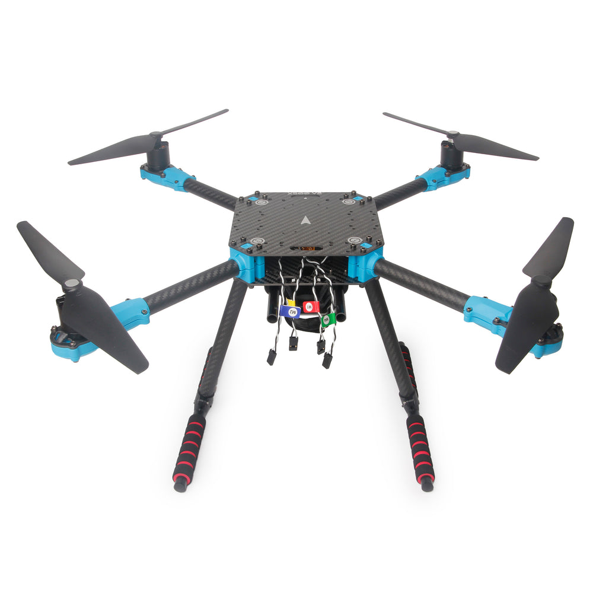
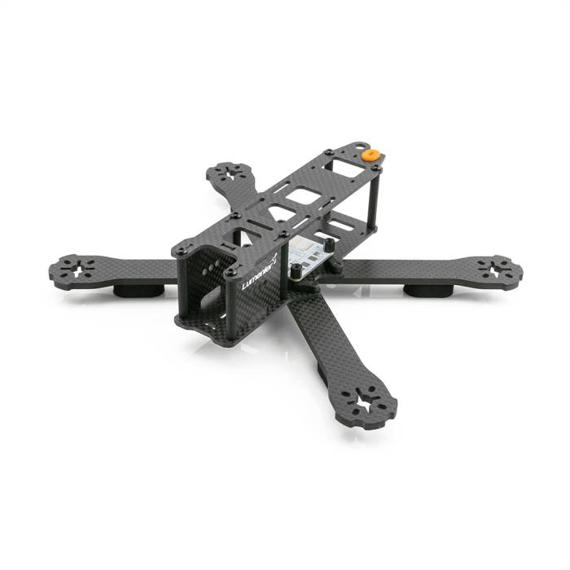
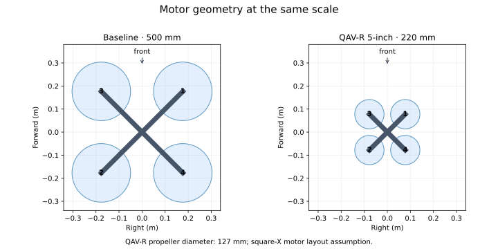

# From 500 mm to a QAV-R

<div class="vehicle-comparison">
  <figure>
    
    <figcaption><strong>Holybro X500 V2</strong><br>500 mm motor diagonal.<br>Photo: <a href="https://holybro.com/products/x500-v2-kits">Holybro</a>.</figcaption>
  </figure>
  <figure>
    
    <figcaption><strong>Lumenier QAV-R, original 5-inch</strong><br>220 mm motor diagonal; 127 mm propellers.<br>Photo: <a href="https://www.getfpv.com/multi-rotor-frames/lumenier-frames/legacy-lumenier-frames/qav-r-fpv-racing-quadcopter-5.html">Lumenier / GetFPV</a>.</figcaption>
  </figure>
</div>

The photos identify the two frame sizes; they are not shown at the same scale.
The X500 illustrates a 500 mm platform. The baseline simulation's 2.5644 kg
mass and aerodynamic parameters come from its existing `gs_drone` model;
they are not measured specifications for the pictured X500 kit.

The baseline `FastDyn.Copter` has a 500 mm motor diagonal (`arm_length = 0.25`)
and a 2.5644 kg mass. The small-frame example targets the original 5-inch
Lumenier QAV-R. Its specified motor diagonal is **220 mm**, so the corresponding
center-to-motor arm length is **0.11 m**. A 5-inch propeller has a 0.127 m
diameter. [Lumenier's QAV-R product specification](https://www.getfpv.com/multi-rotor-frames/lumenier-frames/legacy-lumenier-frames/qav-r-fpv-racing-quadcopter-5.html)
distinguishes this version from the 180 mm and 260 mm variants.

Changing only the arm length is insufficient. You also need to account for
flying mass including battery, inertia, motor/propeller thrust, motor lag,
aerodynamic drag, and ground-contact geometry. The frame's wheelbase is a
manufacturer dimension; inertia and propulsion depend on the actual build.



The layout diagram uses an idealized square-X arrangement. Its large-frame
propeller diameter is 254 mm for illustration; the QAV-R propeller diameter is
127 mm. The original QAV-R's specified diagonal is preserved, but detailed
motor mounting coordinates still need a drawing or measurements for a specific
build.

## Read the smaller model

```modelica
{{#include ../../../modelica/FastDyn/Qavr.mo}}
```

The 0.50 kg equipped mass, inertia tensor, motor coefficients, drag, and motor
lag are explicit tutorial assumptions. The `arm_length = 0.11` setting is half
the specified 220 mm motor diagonal. In the later payload study, this tensor
stays fixed while the prescribed payload weight changes.

Select this model with an overlay:

```toml
{{#include ../../../configs/models/qavr.toml}}
```

In your chosen environment, type:

<!-- fastdyn-check: qavr-config -->
```bash
fastdyn-config --base configs/copter462.toml \
  --overlay configs/models/qavr.toml --output out/qavr.toml
```

Expected output begins `Created out/qavr.toml`. Open that generated file and
check that `[FMU].active` is `qavr` and its class is `FastDyn.Qavr`.

## Tune before the mission

Before flying a full mission with the smaller vehicle, compare controller
responses in the emulated ArduCopter firmware. The existing ArduPilot
[Holybro QAV250 parameter set](https://github.com/ArduPilot/ardupilot/blob/Copter-4.6.2/Tools/Frame_params/Holybro-QAV250.param)
is a candidate gain seed from another small frame. It does not establish a
validated QAV-R tune. Hardware-specific ESC, battery, and notch settings must
not be copied without matching the modeled hardware.

Continue to the [measured controller comparison](tuning.md). Inspect the
recorded ±5° responses and the selected gains' ±10° validation, then export
those gains and use them for your QAV-R mission.
