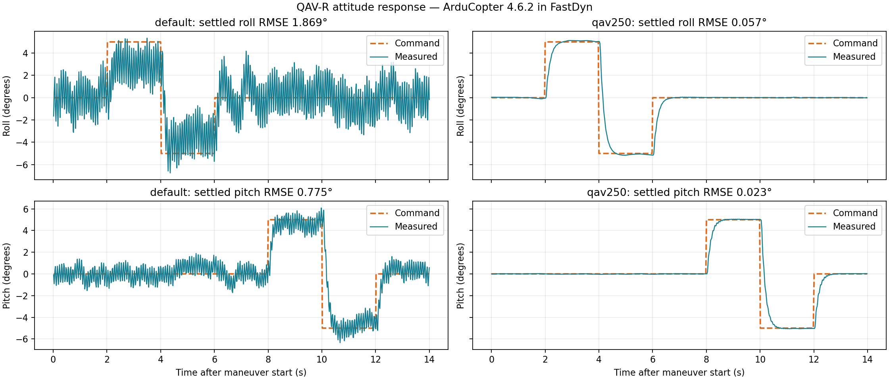

# Experimental gain tuning

Changing the airframe changes the plant seen by the controller. The same
controller torque command produces a different angular acceleration when the
inertia changes. Motor response and available thrust also affect the useful
gain range.

For the one-hour walkthrough, inspect the [recorded comparison](#3-decide-from-the-response)
and [apply the selected gains](#4-use-the-selected-gains-for-a-mission). You can
run the tuning trials yourself using the commands below when you have more time.

## 1. Choose a documented starting point

The experiment compares the ArduCopter defaults with roll/pitch rate gains from
the [Copter 4.6.2 Holybro QAV250 parameter file](https://github.com/ArduPilot/ardupilot/blob/Copter-4.6.2/Tools/Frame_params/Holybro-QAV250.param).
The QAV250 supplies a seed from another small frame. Use the measured responses
below to decide whether that seed is suitable for this simulated QAV-R.
The initial comparison keeps the angle-loop gains the same while varying rate
gains and their filters.

<details><summary>Show all trial settings and candidate gains</summary>

```toml
{{#include ../../../configs/tuning/qavr.toml}}
```

</details>

## 2. Run a controlled maneuver

The runner in `utils/tune_copter.py` creates a fresh run for each candidate,
confirms parameter values returned by the firmware, takes off in GUIDED mode,
and commands alternating roll and pitch steps. It records actual attitude,
controller target rates, altitude, and motor PWM, then lands.

After generating `out/qavr.toml` in the preceding chapter, type:

<!-- fastdyn-check: tuning-comparison -->
```bash
python utils/tune_copter.py --config configs/tuning/qavr.toml \
  --run-config out/qavr.toml --output out/tuning
```

For each successful run, look for
`[tuning] attitude experiment completed and landed` and the per-candidate
`attitude.csv`, `mission.tlog`, `trial.toml`, and `console.log` files, plus a
combined `results.json`.

The helper requests **50 Hz attitude telemetry**; analysis refuses runs below
25 Hz. MAVProxy's periodic stream-rate request is disabled for this experiment
so it cannot overwrite the helper's rates. Each recorded comparison contains
700 attitude samples over 14 seconds.

## 3. Decide from the response

Compare attitude error during transitions and after settling. **RMSE** is
root-mean-square error; lower values mean closer tracking. Check rate
tracking, sustained oscillation, altitude retention, and motor limits. Keep
the chosen gains fixed while increasing the maneuver amplitude for a separate
validation run, then fly the waypoint mission. Diagnose compiler or startup
errors before drawing conclusions about the gains.



| Candidate | Settled roll RMSE | Settled pitch RMSE | Altitude during steps |
| --- | ---: | ---: | ---: |
| ArduCopter defaults | 1.869° | 0.775° | 7.994–8.045 m |
| QAV250 seed | **0.057°** | **0.023°** | 7.994–8.042 m |

These measurements use the current array-based model and **Rumoca `21843c11`**.
“Settled” includes samples more than one second after each command change.
Both candidates finished and landed, but the default gains produced sustained
oscillation. The selected QAV250 seed also passed an independent **±10°**
experiment: settled roll/pitch RMSE was 0.070°/0.049°, and altitude remained
8.005–8.041 m. This is a tested choice for these maneuvers, not an optimal-gain claim.

[Comparison results](../assets/qavr-tuning/tuning-50hz/results.json) ·
[Default CSV](../assets/qavr-tuning/tuning-50hz/default/attitude.csv) ·
[Selected CSV](../assets/qavr-tuning/tuning-50hz/qav250/attitude.csv) ·
[Selected MAVLink log](../assets/qavr-tuning/tuning-50hz/qav250/mission.tlog) ·
[Validation results](../assets/qavr-tuning/tuning-validation/results.json) ·
[Compiler and model provenance](../assets/qavr-tuning/provenance.toml)

Reproduce the larger maneuver and plot either batch:

<!-- fastdyn-check: tuning-validation -->
```bash
python utils/tune_copter.py --config docs/book/assets/qavr-tuning/validation.toml \
  --candidate qav250 --run-config out/qavr.toml --output out/tuning-validation
python utils/tuning_report.py --input out/tuning --output out/tuning-response.png
```

## 4. Use the selected gains for a mission

Export the settings from the source TOML, then apply the controller overlay:

<!-- fastdyn-check: qavr-flight -->
```bash
python utils/tune_copter.py --config configs/tuning/qavr.toml \
  --candidate qav250 --export-parameters out/qavr-controller.param
fastdyn-config --base configs/copter462.toml \
  --overlay configs/models/qavr.toml \
  --overlay configs/models/qavr-controller.toml --output out/qavr.toml
fastdyn run -c out/qavr.toml -o out/qavr/work
```

Expect `Wrote out/qavr-controller.param (27 parameters)`, then mission progress
ending in `final landing confirmed near ground`. This waypoint mission passed
with the selected gains. Keep the controller overlay for the next physics
experiment so that a model change is the only intended difference.

The procedure follows the distinction between initial stabilization and later
tuning in [ArduPilot's tuning process](https://ardupilot.org/copter/docs/tuning-process-instructions.html).
These experiments tune the simulated plant; transferring gains to hardware
requires its own validation.
