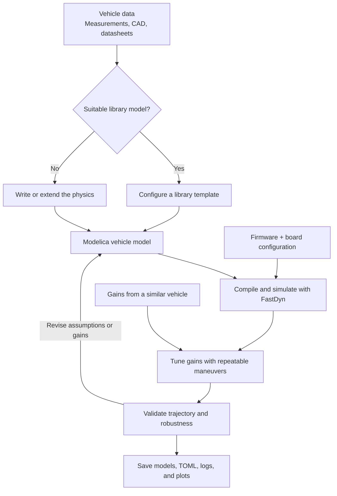

# From vehicle data to a firmware experiment

## 1. Gather the data

Measure the flying mass with its battery and payload. Obtain motor locations
from drawings or measurements, and estimate inertia from CAD or component
masses and their positions. Use motor/propeller thrust measurements for the
actuator model. Record units, reference frames, test conditions, and uncertain
quantities with the model.

| Quantity | Useful source | When unavailable |
| --- | --- | --- |
| Geometry | Manufacturer dimensions, CAD, calipers | State the idealized layout |
| Mass and CG | Scale and balance measurements | Sum components and record locations |
| Inertia | CAD, pendulum measurement | Compute a component approximation and sweep it |
| Propulsion | Thrust stand and motor response logs | State a coefficient/lag assumption |
| Firmware gains | A previous tune for the same vehicle | Use a similar frame as a seed, then test |

## 2. Choose a nearby model or a template

Search `third_party/common/modelica_models` for a plant with appropriate states
and forces. The tutorial reuses `Vehicles.Templates.QuadrotorPlant` and wraps it
with `FastDyn.Copter` to expose the sensor/PWM interface. Use `extends` to make
a named vehicle variant, or change the equations when the existing physics
cannot represent the behavior you need.

The library also contains named vehicles and closed-loop controller/mission
models. See [model library and roadmap](library-roadmap.md) for those starting
points and how Modelica controller ports complement firmware runs in FastDyn.

## 3. Pair the plant with firmware

The model defines the vehicle. The TOML also chooses the firmware binary,
board configuration, sensor drivers, timing, helper processes, and controller
parameter file. Compile with Rumoca, then run the resulting FMI 3.0 plant with
ArduCopter 4.6.2 in FastDyn. Verify stationary sensors and actuator directions
before evaluating a flight.

## 4. Tune, then validate

Start with conservative gains or a documented similar-frame seed. Use a
repeatable maneuver to compare tracking, oscillation, altitude retention, and
motor limits. Keep the selected gains fixed for a separate mission and an
uncertainty study. A tune that fits one idealized plant may have little margin
when inertia or motor dynamics change.

## Why equations matter

A TOML or SDF parameter set selects numbers for behavior implemented elsewhere.
Modelica also lets the model author express equations, component connections,
and additional states, then compile those into the plant. Here, the side-load
model rotates an applied force into body coordinates and computes its moment
from the attachment location. The plant adds both to its equations of motion.

Gazebo/SDF can also represent offset inertias, joints, and payloads, and plugins
can add custom forces. The advantage illustrated here is keeping the physical
relationships in composable Modelica source with the vehicle, while retaining
FastDyn's firmware-driver interface.
